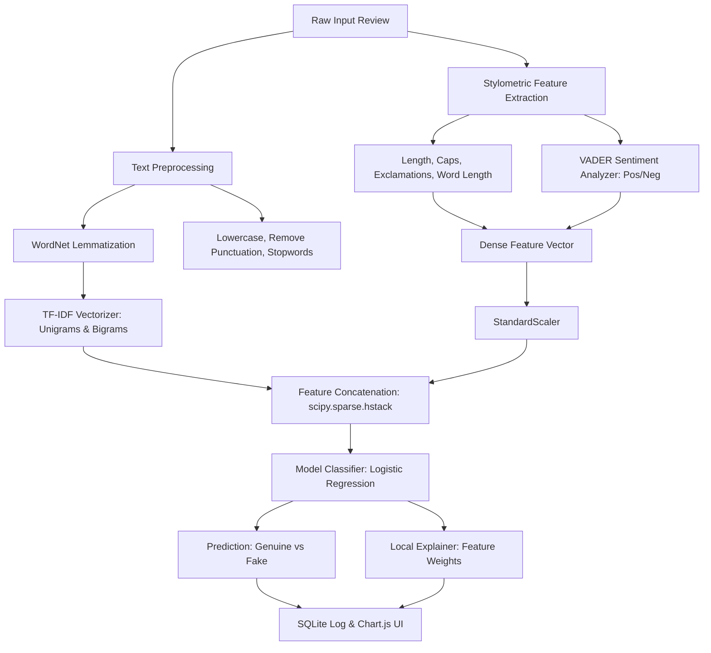

# Fake Product Review Detection Using Machine Learning

A complete, production-ready, offline-first web application that predicts whether a product review is **Genuine** or **Fake** using Natural Language Processing (NLP), Stylometric Feature Engineering, and Machine Learning.

This project is structured and documented to serve as a B.Tech Computer Science / AI-ML Capstone Project or Term Paper.

---

## 1. Project Overview & Abstract

With the exponential growth of e-commerce, online reviews have become a critical factor influencing purchasing decisions. However, this has led to the rise of **opinion spam**—fake reviews written strategically to artificially promote (hype) or denigrate (demote) products. 

This project implements a hybrid machine learning pipeline that combines **Lexical Features** (TF-IDF unigrams and bigrams) with **Stylometric Features** (review length, exclamation count, capital letter count, average word length) and **Sentiment Intensity polarity scores** (extracted using the NLTK VADER lexicon). The application trains a **Logistic Regression** classifier (primary model for local explainability coefficients) and compares it with a **Random Forest Classifier**. The backend is built on **Flask**, database logging is managed via **SQLite**, and the frontend is rendered as a responsive dashboard using **Bootstrap 5**, **Chart.js**, and client-side PDF export.

---

## 2. System Architecture & Proposed Methodology

The pipeline follows a structured MVC-like (Model-View-Controller) architecture:



### Preprocessing Steps:
1. **Text Normalization**: Conversion of all characters to lowercase to prevent duplications.
2. **Noise Reduction**: Stripping out punctuation and excessive whitespaces using regex mapping.
3. **Stopword Elimination**: Removing non-informative grammatical terms (e.g., *the, a, is, at*) using the NLTK English stopwords dictionary.
4. **Lemmatization**: Reducing words to their base linguistic dictionary form (e.g., *running, runs, ran* $\rightarrow$ *run*) using NLTK's `WordNetLemmatizer` with morphological parsing.

---

## 3. Mathematical Foundations & Algorithms

### A. TF-IDF (Term Frequency-Inverse Document Frequency)
TF-IDF measures the statistical importance of a word (n-gram) within a document relative to the entire corpus.
- **Term Frequency (TF)**:
  $$\text{TF}(t, d) = \frac{\text{Number of times term } t \text{ appears in document } d}{\text{Total number of terms in document } d}$$
- **Inverse Document Frequency (IDF)**:
  $$\text{IDF}(t, D) = \log\left(\frac{1 + |D|}{1 + |\{d \in D : t \in d\}|}\right) + 1$$
- **TF-IDF Weight**:
  $$\text{TF-IDF}(t, d, D) = \text{TF}(t, d) \times \text{IDF}(t, D)$$

### B. Logistic Regression (Primary Model)
Logistic Regression models the probability of a review being Fake ($y=1$) using the Sigmoid (logistic) function:
$$P(y=1|x) = \sigma(z) = \frac{1}{1 + e^{-z}}$$
where $z$ is the linear combination of inputs:
$$z = \beta_0 + \beta_1 x_1 + \beta_2 x_2 + \dots + \beta_k x_k$$

#### Explainability Mechanism:
Because we combine TF-IDF and dense features linearly, the model's coefficients ($\beta_i$) represent the log-odds impact of each feature:
- $\beta_i > 0$: The presence of word/metric $x_i$ increases the probability of the review being **Fake**.
- $\beta_i < 0$: The presence of word/metric $x_i$ increases the probability of the review being **Genuine**.
- Contribution of feature $x_i$ to a specific prediction is calculated as $c_i = x_i \cdot \beta_i$. These are sorted and shown to the user on the Results page.

### C. Random Forest Classifier (Comparison Model)
An ensemble learning method that builds a multitude of decision trees during training. It uses **bagging** (bootstrap aggregating) to train individual trees on different subsets of the data and outputs the mode of the classes (classification) of the individual trees, reducing variance and mitigating overfitting.

---

## 4. Project Directory & File Explanation

```
FakeReviewDetection/
│
├── app.py                  # Web application controller, routing, and SQLite DB connector.
├── model.py                # Preprocessing core, feature engineering, and Local Explainer.
├── train_model.py          # Dataset generator, model comparison, training, and serialization.
├── requirements.txt        # Python package dependencies.
├── dataset.csv             # Generated training review dataset.
├── model.pkl               # Serialized Logistic Regression model.
├── vectorizer.pkl          # Serialized TF-IDF Vectorizer.
├── scaler.pkl              # Serialized StandardScaler for numeric features.
├── database.db             # SQLite database storing prediction logs (auto-generated).
├── model_metadata.json    # JSON storing model evaluation scores and confusion matrix.
│
├── static/
│   ├── css/
│   │   └── style.css       # Stylesheets supporting custom fonts, Dark/Light modes, and PDF print styles.
│   └── js/
│       └── script.js       # Client interaction, Form validation, Chart.js layouts, and PDF export.
│
└── templates/
    ├── index.html          # Homepage with analyzer text field and quick sample triggers.
    ├── result.html         # Predict results page featuring explanation panels and donut charts.
    └── dashboard.html      # Stats dashboard displaying confusion matrices and model comparison bars.
```

- **`requirements.txt`**: Specifies all required Python libraries.
- **`model.py`**: Defines standard text cleaning routines, custom feature extraction (caps, exclamations, sentiment), and the local mathematical explainer.
- **`train_model.py`**: Automatically constructs a mock dataset of 720 records, trains both models, runs 5-fold cross-validation, and saves the binary files.
- **`app.py`**: Handles incoming HTTP POST requests, feeds input to the model pipeline, writes to SQLite, and compiles statistics for the dashboard.
- **`static/css/style.css`**: Provides a premium dark/light mode responsive layout, styling indicators, card overlays, and transitions.
- **`static/js/script.js`**: Integrates client-side logic, updates character counter, instantiates Chart.js graphs, and handles HTML-to-PDF rendering.

---

## 5. Model Evaluation Metrics

B.Tech students should note the standard metrics computed during training:

1. **Confusion Matrix**:
   - **True Negatives (TN)**: Genuine reviews classified correctly as Genuine.
   - **False Positives (FP)**: Genuine reviews misclassified as Fake (Type I Error).
   - **False Negatives (FN)**: Fake reviews misclassified as Genuine (Type II Error).
   - **True Positives (TP)**: Fake reviews classified correctly as Fake.
2. **Accuracy**: $\frac{TP + TN}{TP + TN + FP + FN}$
3. **Precision**: $\frac{TP}{TP + FP}$ (Proportion of predicted fakes that are actually fake).
4. **Recall (Sensitivity)**: $\frac{TP}{TP + FN}$ (Proportion of actual fakes that were caught).
5. **F1-Score**: $2 \times \frac{\text{Precision} \times \text{Recall}}{\text{Precision} + \text{Recall}}$ (Harmonic mean of Precision and Recall).

---

## 6. Installation & Execution Guide

Follow these steps to run the application on your local machine:

### Prerequisites:
Make sure you have **Python 3.8+** installed on your system.

### Step 1: Clone or Copy the Workspace Directory
Ensure all project files are located in your working directory (e.g., `C:\Users\jampa\OneDrive\Desktop\fake review dectation`).

### Step 2: Open Terminal / PowerShell
Navigate to your project root folder:
```powershell
cd "C:\Users\jampa\OneDrive\Desktop\fake review dectation"
```

### Step 3: Create and Activate a Virtual Environment (Recommended)
Creating a virtual environment ensures that the project dependencies do not interfere with other Python applications on your computer.
```powershell
# Create virtual environment
python -m venv venv

# Activate virtual environment
# On Windows (PowerShell):
.\venv\Scripts\Activate.ps1
# On Windows (CMD):
.\venv\Scripts\activate.bat
```

### Step 4: Install Dependencies
Install all the libraries listed in the `requirements.txt` file:
```powershell
pip install -r requirements.txt
```

### Step 5: Train the Models
Run the training script. This script will automatically create `dataset.csv` (if it does not exist), download required NLTK corpuses (stopwords, wordnet, vader_lexicon), train both models, print evaluation reports, and serialize the pickles.
```powershell
python train_model.py
```
*Note: Make sure you are connected to the internet the first time you run this command so Python can download NLTK data. All subsequent runs can be done entirely offline.*

### Step 6: Launch the Web Application
Run the Flask server:
```powershell
python app.py
```

### Step 7: Open the Application in your Browser
Once the server starts, open your browser and navigate to:
```
http://127.0.0.1:5000/
```

---

## 7. Key Features Checklist

- [x] **Hybrid Feature Spaces**: Combines TF-IDF n-grams with structural text stats (lengths, capital letters, exclamation points).
- [x] **Sentiment Analysis Integration**: Incorporates positive and negative sentiment values calculated via NLTK VADER.
- [x] **Dual Model Benchmarking**: Trains Logistic Regression (interpretable weights) and Random Forest (ensemble trees), saving the best.
- [x] **Explainable AI (XAI)**: Demystifies predictions on the results page by listing the exact word coefficients and text structure metrics that pushed the decision.
- [x] **Local History Logging**: Saves every prediction to a local SQLite database (`database.db`).
- [x] **Rich Interactive Dashboard**: Displays total analyses, fake-to-genuine ratios, active accuracies, model comparison charts, and the confusion matrix.
- [x] **Modern Responsive UI**: Features a beautiful glassmorphic card design supporting dark/light mode switches.
- [x] **Exportable PDF Reports**: Let users download full predictive verification sheets formatted clean for paper printing.
- [x] **Zero Cloud Cost**: Runs completely offline, avoiding expensive, rate-capped API dependencies.
